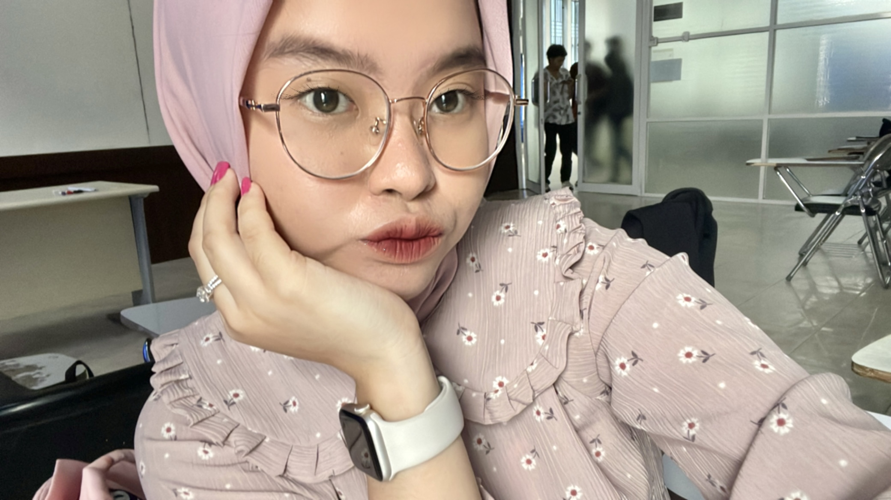

# PW5_UTS_221401012
Berikut ini adalah UTS Lab Pemweb 5

<html lang="en">
  <head>
    <meta charset="utf-8">
    <meta name="viewport" content="width=device-width, initial-scale=1">
    <title>Tentang Aqila</title>
    <link href="https://cdn.jsdelivr.net/npm/bootstrap@5.3.2/dist/css/bootstrap.min.css" rel="stylesheet"
    integrity="sha384-T3c6CoIi6uLrA9TneNEoa7RxnatzjcDSCmG1MXxSR1GAsXEV/Dwwykc2MPK8M2HN" crossorigin="anonymous">

    
  </head>
  <body>

    <!-- Header Website -->
    <header class="navbar-container">
      

      <h1>TENTANG AQILA</h1>
      

          Website ini berisi cerita singkat saya selama menempuh jenjang pendidikan
      

      

  
      <!-- Navigasi -->
      <nav class="nav-list">
        <ul>
      <li><a href="#Cerita SD">Cerita SD</a></li>
      <li><a href="#Cerita SMP">Cerita SMP</a></li>
      <li><a href="#Cerita SMA">Cerita SMA</a></li>
      <li><a href="#Cerita Universitas">Cerita Universitas</a></li>
        </ul>
      </nav> 
    </header>

    <!-- Isi dari website -->
    <main>
        

        

        

      <article>
        <section>
          <h3 id="Cerita SD">Cerita SD</h3>
          

            Saya duduk di bangku Sekolah Dasar saat memasuki usia 7 tahun.Sebelumnya saya libur 1 tahun tidak sekolah karena
          menurut orang tua saya,umur 6 tahun masih tergolong sangat muda memasuki Sekolah Dasar. Saya bersekolah di SD Brigjend
          Katamso Medan. Saya memasuki tingkat Sekolah Dasar dengan rasa gembira karena saya dahulu sangat antusias belajar mengenal
          huruf dan angka mulai dari umur 3,5 tahun. Setiap pagi mama saya membangunkan saya tidur. Lalu mandi dengan air hangat dan tidak
          lupa sarapan telur kesukaan saya yang disiapkan mama saya. Kucir dua menjadi model andalan rambut dengan pita merah muda diatasnya.
          Lalu mama saya mengantar saya sekolah naik angkutan umum. Mama saya menunggu di sekolah sampai pulang sekolah. Dan pada
          saat istirahat, mama saya memberi bekal jajanan. Saya juga sering mengikuti olimpiade semasa Sekolah Dasar. Dan yang paling
          terkejutnya,saya pernah mengikuti olimpiade di Universitas Sumatera Utara yang mana pada saat itu saya kepikiran dan sangat
          berkeinginan berkuliah disana. Dan waktu menjawab semuanya, 6 tahun kemudian saya lulus di Universitas Sumatera Utara. 
          Pada saat SD adalah masa yang dijalani dengan penuh sukacita tanpa memikirkan beban hidup sama sekali.
          

          <!-- Penggunakan card -->
          

          

            
            

              <h5 class="foto">Foto SD</h5>

              <!-- Penambahan Link Reference -->
            <a href="InformasiSekolah.html" class="btn btn-primary mr-2">Baca Selengkapnya</a>
            

          

        </section>
      

  
    <section>
      <h3 id="Cerita SMP">Cerita SMP</h3>
      

        Orang-orang pada umumnya,menganggap masa SMA adalah jenjang pendidikan terseru,tetapi bagi saya masa SMP menjadi masa 
      paling seru dalam hidup saya. Tamat dari jenjang Sekolah Dasar,saya melanjutkan pendidikan di SMP Negeri 1 Medan,yaps seperti
      namanya,SMP negeri utama di Kota Medan. Saat SMP, saya sudah mulai mengenal yang namanya organisasi,walaupun saya awalnya
      sangat terkejut. Saya mencoba ikut organisasi OSIS pada saat itu. Seleksi terakhirnya adalah nginap di sekolah selama satu
      malam. Pada saat jam 2 malam,kami dibangunkan untuk mengikuti pelatihan yang diinstruksikan kakak kelas pada saat itu. 
      Kegiatan tersebut sangat seru tetapi sedikit menegangkan mengingat saya adalah seorang yang takut akan gelap. 
      Tetapi dari kegiatan itu,saya bisa belajar banyak hal. Lalu saya juga pernah mengikuti kegiatan pramuka di Taman Dewi Berastagi. 
      Kami naik bus kesana,pada malam harinya kami nyanyi-nyanyi sambil main permainan. Seperti halnya kegiatan sebelumnya, kami
      juga dibangunkan jam 2 malam mengikuti serangkaian kegiatannya. Udara di Berastagi sangat dingin apalagi saat kondisi jam 2 malam.
      Tetapi kegiatan tersebut dapat lebih mempererat persahabatan dan mengundang tawa. Saya mendapatkan banyak teman di masa SMP yang
      sampai saat sekarang tetap berteman erat. Saya menganggap persahabatan di SMP sangat menyenangkan. Itulah mengapa masa SMP
      menjadi masa paling seru selama saya menempuh pendidikan.
      

      <!-- Penggunakan card -->
      

        

          
          

            <h5 class="foto">Foto SMP</h5>

            <!-- Penambahan Link Reference -->
            <a href="InformasiSekolah.html" class="btn btn-primary mr-2">Baca Selengkapnya</a>
          

        

      </section>
    

    <section>
      <h3 id="Cerita SMA">Cerita SMA</h3>
      

        Saat masa SMA, saya sudah mulai mengerti tentang kehidupan yang lebih serius. Dalam jenjang ini,saya harus bisa lebih mengontrol
      diri dan mengatur waktu sebaik mungkin. Saya melanjutkan Sekolah Menengah Atas di SMAN 15 Medan yang jaraknya tidak jauh dari rumah saya. 
      Tetapi masa SMA dilakukan secara online selama 2 tahun. Pembelajaran melalui zoom adalah keseharian
      murid di masa pandemi. Karena pandemi juga, jarang bertemu dengan teman,hanya melalui obrolan di whatsapp saja. Masa-masa SMA yang sebagian
      orang menganggap masa-masa terindah selama sekolah,tetapi untuk angkatan di masa pandemi hanyalah bisa dilakukan secara daring. 
      Tetapi pada saat kelas 12 SMA,sekolah sudah mulai dilakukan tatap muka. Tetapi kelas 12 bukan waktu untuk banyak bersantai lagi. Perguruan Tinggi negeri
      impian sudah menanti. Setiap hari bimbingan belajar dan buku UTBK yang menjadi teman murid kelas 12. Waktu untuk santai dan nongkrong dengan teman-teman 
      sudah habis di masa pandemi. Bisa dikatakan masa SMA saya, waktu untuk senang-senang dengan teman terhalang pandemi,saat pandemi mulai hilang masa untuk
      serius meraih Perguruan Tinggi Impian sudah didepan mata.
      
 

      <!-- Penggunakan card -->
      

        

          
          

            <h5 class="foto">Foto SMA</h5>

            <!-- Penambahan Link Reference -->
            <a href="InformasiSekolah.html" class="btn btn-primary mr-2">Baca Selengkapnya</a>
          

        

      </section>
    

    </section>
  
    <section>
      <h3 id="Cerita Universitas">Cerita Universitas</h3>
      

        Saya melanjutkan pendidikan saya di Universitas Sumatera Utara,universitas impian sejak Sekolah Dasar. Saya lulus di Universitas Sumatera Utara
        melalui jalur SNMPTN. Saya mengambil jurusan Ilmu Komputer, walaupun saya sebelumnya tidak ada dasar pengetahuan tentang jurusan ini. Saya yakin
        jika kita ada kemauan pasti ada jalan untuk bisa memahami semua mata kuliah di jurusan Ilmu Komputer. Seperti pada biasanya,makanan sehari-hari 
        anak komputer adalah codingan. Saya di semester 1 sama sekali belum mengetahui seperti apa menjalankan suatu program. Kebetulan di semester 1, kami
        belajar bahasa pemrograman pascal. Ketika saya sudah memasuki semester 3,saya mulai mengikuti organisasi di semester 3 ini, saya menjadi anggota
        departemen kemahasiswaan yang mana tugasnya sangat berkaitan erat dengan para mahasiswa/i ilmu komputer. Saya mendapatkan teman-teman yang sefrekuensi 
        yang bisa diajak bekerja sama dalam pendidikan kuliah ini. Saya sangat menikmati masa kuliah ini dengan suka cita walaupun terkadang lelah menghadapi
        tugas-tugas dan proyek yang menumpuk. Tetapi,kuliah itu menyenangkan ketika dijalani dengan ikhlas dan penuh suka cita. 
      

      <!-- Penggunakan card -->
      

        

          
          

            <h5 class="foto">Foto Kuliah</h5>
            <!-- Penambahan Link Reference -->
            <a href="InformasiSekolah.html" class="btn btn-primary mr-2">Baca Selengkapnya</a>
          

        

      </section>
    

      </section>
      </article>
  
      <aside> 
        <h2 id="Biodata" align="center">Biodata</h2>
        
 Nama: Aqila Eling Febrianti

        
Domisili: Medan

        
Tanggal Lahir: 24 Februari 2004

        
Pendidikan terakhir: SMA

        
Pendidikan saat ini: Universitas Sumatera Utara

        
Hobi: membaca novel dan memasak 

        
Warna Kesukaan: merah muda

        
Makanan kesukaan: ayam bakar

        
Minuman kesukaaan: jus alpukat
 

        <!-- Penggunaan Carousel -->
        

          

            

              
            

            

              
            

            

              
            

          

          <button class="carousel-control-prev" type="button" data-bs-target="#carouselExampleFade" data-bs-slide="prev">
            
            Previous
          </button>
          <button class="carousel-control-next" type="button" data-bs-target="#carouselExampleFade" data-bs-slide="next">
            
            Next
          </button>

          <!-- Penggunaan Button mengarah ke instagram -->
          

          

          <a href="https://instagram.com/aqilarnt_?igshid=azc5MjV2bmw1NXp2&utm_source=qr" target="_blank" class="btn btn-light mr-2">Instagram</a>
        

      

        

    </aside>
      

      

      

      </main>
  
      <!-- Footer  -->
    <footer>
      
Dibuat oleh Aqila, 2023 November

    </footer>
    
  
  </body>
  </html>"tampilan part 9" src="https://github.com/DP5-AqilaEling-012/PW5_UTS_221401012/assets/114634831/d76f5e97-06a9-4418-928a-9cdf9c50b603">

